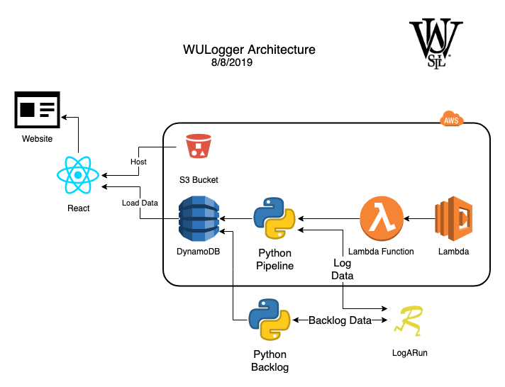

# WUSTL Logger
Website where runners can log runs and share with others.

## Getting Started
Clone the project
```bash
git clone https://github.com/bradh43/wulogger.git
```
If on mac install homebrew
```bash
/usr/bin/ruby -e "$(curl -fsSL https://raw.githubusercontent.com/Homebrew/install/master/install)"
```
Install NPM and Node from https://www.npmjs.com/get-npm

Install python3
```bash
brew install python3
```

## Architecture
<p align="center">
  
</p>


# WUXC LogARun

What started as a funny joke of remaking our favorite website has turned into a legitimate project. Should give us a great opportunity to learn about all facets of full stack development, as well as provide an opportunity to code something a little more robust than the snake game or a sorting algorithm.

# Implementation

Not sure what other people think about for front-end/server/database stuff, but there are a ton of options that we can look towards for different aspects of the project.

## Front-End Stuff

React. That's pretty much it. HTML and CSS (SCSS?) are defaults and will be used, of course, but React will allow us to "modularize" different aspects of the site into smaller components. If you haven't used React before, their documentation is fairly decent and there are really good tutorials/walkthroughs for all levels. Don't have any specific links to the best ones, but feel free to add them in the Resources section if you find ones you like!

## Server-side

This is the section that isn't completely nailed down. Our thought is to go serverless to some degree, mostly trying to minimize cost and branch out into some newer technologies. If anyone has strong feelings about some framework/platform/server implementation reach out to someone. 

In any case, we could always use a Node.JS server up on some EC2 instance as a fallback. This is known to work (most of us should have seen this in 330 or some other class?) and while costing more than serverless really wouldn't end up being too much. If this somehow gets really big and we get tons of throughput to the site then we can adjust and perhaps rethink our strategy.

## Database / Data Storage

Loads of ways we could approach this portion, and nothing is set as of now. We are leaning towards DynamoDB (some testing development has been done and PoC is already completed), but there are a few strong cases for something not inside of AWS just in case we pivot from the whole "AWS is God" mindset. MongoDB has some pretty decent infrastructure for larger data sets (assuming this ends up being used and we need to start storing logs somewhere).

## Project Tracking

Depending on how serious we end up about keeping progress moving forward, we would end up needing to use something that keeps track of different phases of the project. A project has been built on PivotalTracker already (https://www.pivotaltracker.com/n/projects/2422462), but we can certainly use a scrumboard-esque thing if that appeals to more people. PivotalTracker only allows three users on a single project for the free version, but it is quite good for visualizing where things need to go. Of course, GitHub Projects has already been started for this project and has worked decently, it is a great option if we try to stay strict to it.

## Features

There is a lot that goes into a logging app (shocking), so this will hopefully give us a roadmap to some degree. Nothing is set in stone, and we can always add/remove stuff as we see fit.

- User Profiles
  - Option to be public and private, not sure about the granularity of what "private" entails yet.
- Logging Runs (duh)
  - Calendar style to see month by month, or week by week
  - Title for the log, as well as some note for that day
  - Personal view as well as Team view
  - Activity Information
    - Route names
    - Mileage, Distance, Shoe Selection
    - Default shoes, Retired shoes, Mileage per shoe
  - Customized Workouts
    - Workout creation and Naming (CVs, 4-4-2, Country Club Sub-60)
    - Type of workout (similar to naming, to some degree)
    - Split times for the given workout
    - Search functionality
    - Ability to point to a Team or an Individual (better for coaches to set stuff up)
  - Commenting on other users' logs
  - Tagging other runners in your own log
- Teams
  - Ability to create and join a team with other runners
  - Team can be public or private (same issues of granularity as before)
  - Owner/Coach/Manager of teams
    - Ability to add/remove athletes from the team
    - Ability to transfer ownership to another user
- Overall Features
  - Emojis!
  - Picture and video integration
  - GPS hooks, similar to Strava
  - Notifications
  - Some AI aspect for predictions, suggestions, or generating similarity graphs (this is Zac's idea, really just like the AI/ML side of things at this point...)
  
## Coding and Architecture Practices

There are a multitude of different opinions on how to correctly develop things, but we will try to follow CI/CD the best we can. If people have experience with this, great! If not, then it's a great opportunity to start to see how things work.

We can also try to have this be a fully tested application. Test Driven Development (TDD) is a great way to ensure this, and while it may take some time to get used to and will feel like it slows everything down, it certainly speeds things up in the future. We recommend going through the TDD resource if you want to learn more about this.
  
# Resources

Any website or information that you feel is important/helpful/interesting/mildly amusing should go here! Anything that allows the project to continue moving forward is appreciated.

- TDD: https://www.eecs.yorku.ca/course_archive/2003-04/W/3311/sectionM/case_studies/money/KentBeck_TDD_byexample.pdf
- CI: https://github.com/jhulick/bookstuff/blob/master/Addison.Wesley.Continuous.Integration.Jun.2007.pdf
- CD: http://www.synchronit.com/downloads/Continuous%20Delivery%20-%20Reliable%20Software%20Releases%20Through%20Build,%20Test%20And%20Deployment%20Automation.pdf

 ## Dumb Features - Place for dumb ideas that aren't important but can be used once a year
  - Export data from user profile of runs and average paces by day.
  - Export data from TEAM of runs and average paces
  - Define less than 5 emojis to classify runs  (can't have too many ways to classify runs)
  - ability to flag personal run as pain sensitive. Shows up as red on your calender. Easier to find runs where you felt exceptionally bad or something hurt.
  - (Zac) Depending on how far we get, could do on-the-fly analysis of pace/sentiment/mileage or whatever
